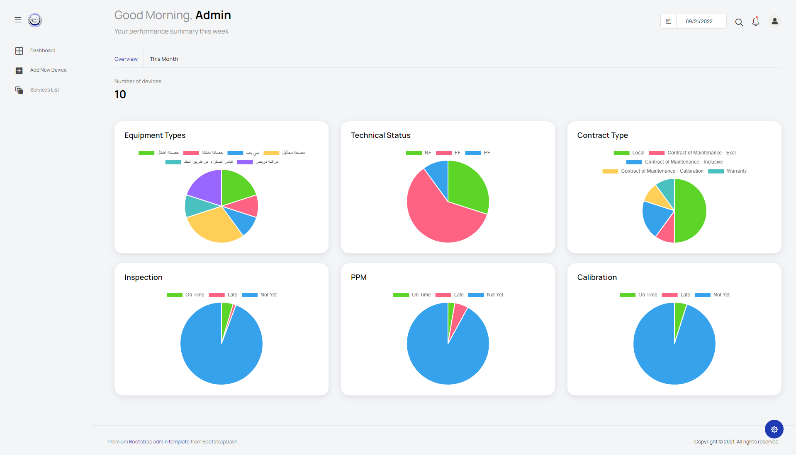
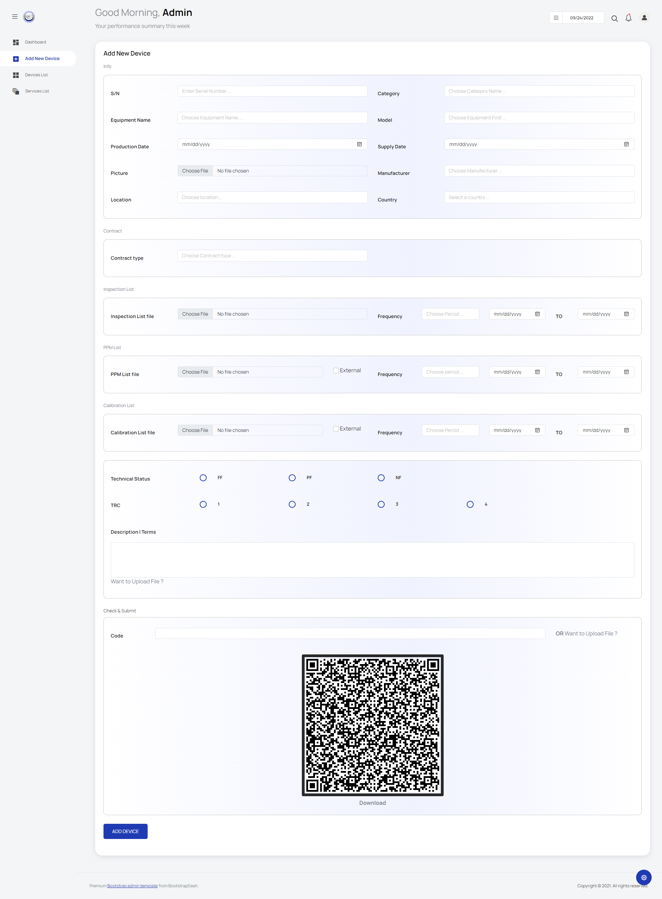
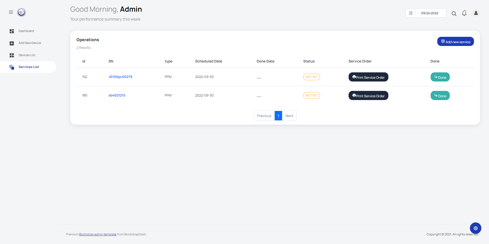
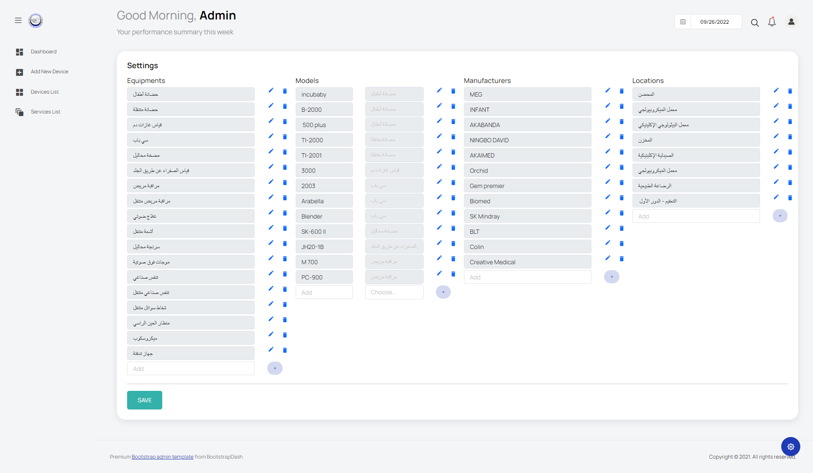
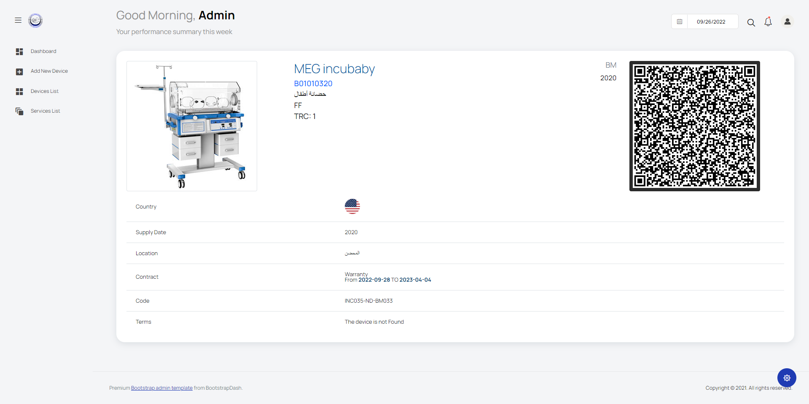
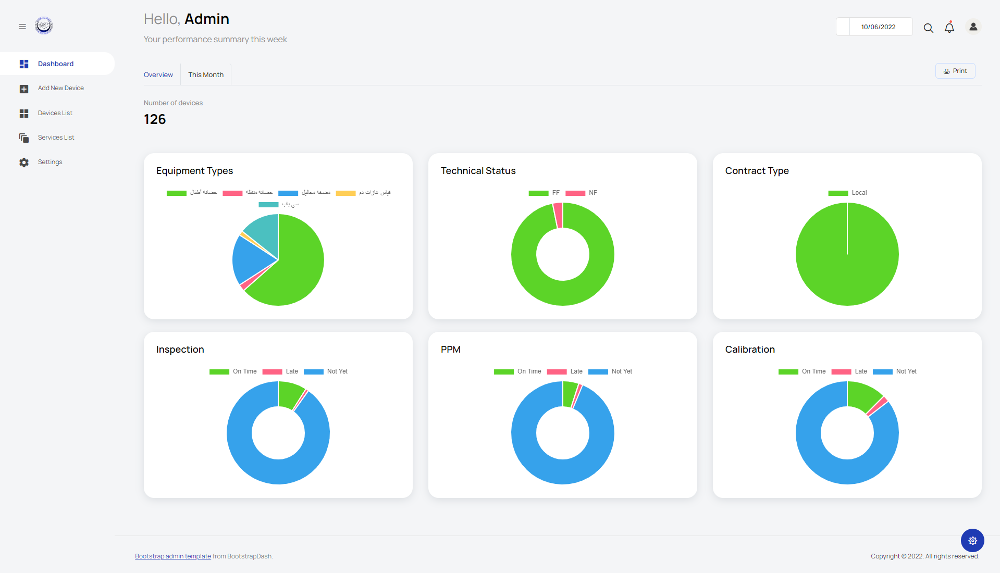
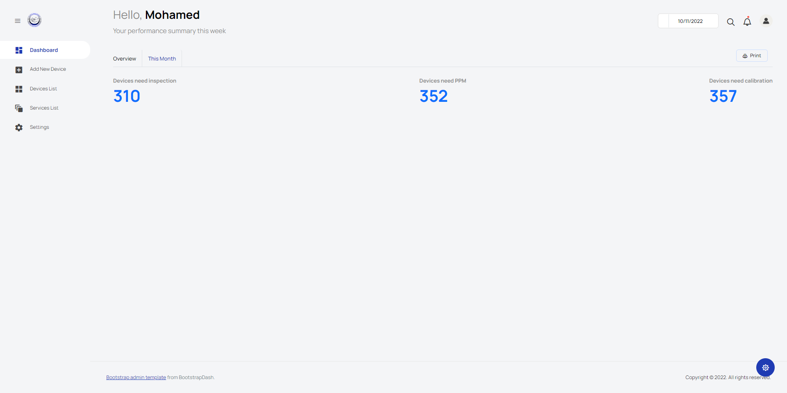
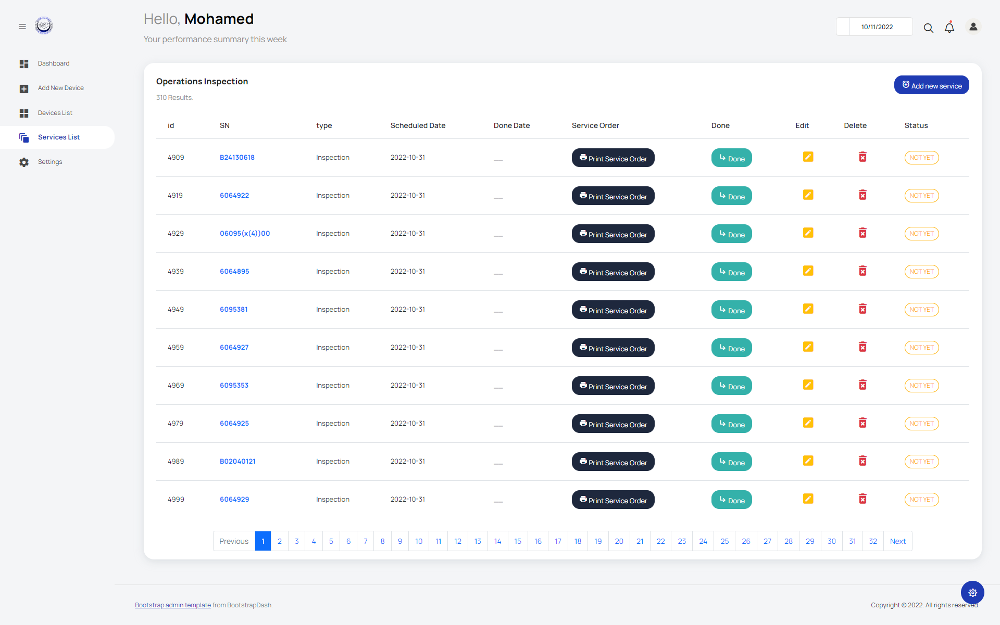

# Hospital Dashboard

Dashboard for hospital controls the system of devices services (Calibrations, PPM, Inspection) and store the data of equipments.

----

### prequisties:

- Html
- Css
- Js
- Bootstrap
- Python with Flask

---

### Preview:

